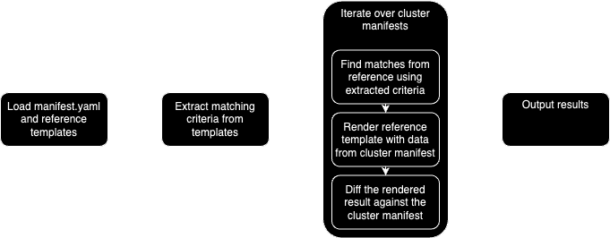

# Development

Please read the [Contributing Guide](./contributing.md) for guidance on how to structure a contribution and what to expect.

## Tool Overview

To aid with a mental model a high level execution flow of the tool is shown here:

From a simplistic point of view the tool is a special-purpose templating engine that attempts to find the template from among the references which, when rendered, will best match the cluster manifest. It then reports the differences between the rendered result and the cluster manifest.

## Key Components

### Correlators

Correlators are the mechanism by which a cluster manifest is matched to a template from the reference. Various types of Correlator are available with different matching criteria, see the [implementations](../pkg/compare/correlator.go) for more details.

## Tests

TODO details on how to write tests
